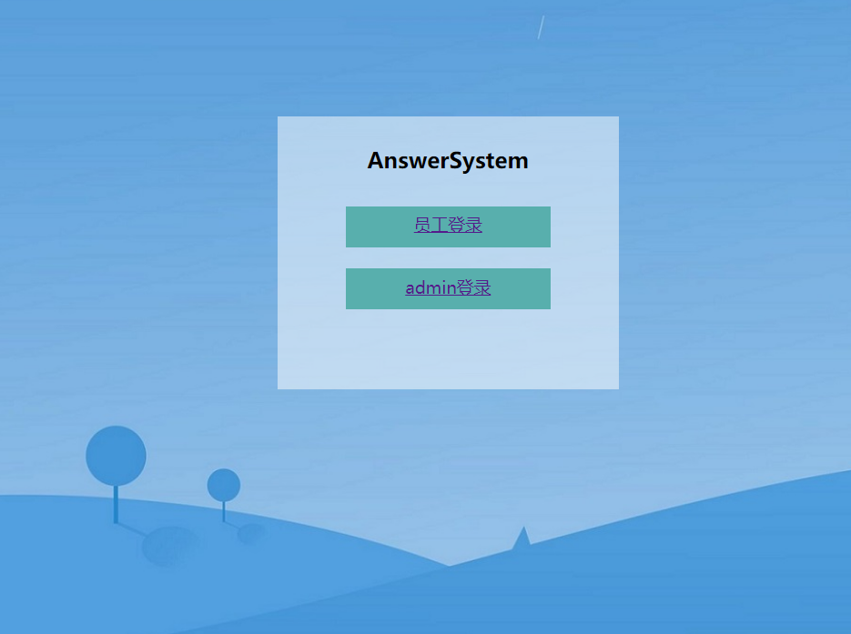
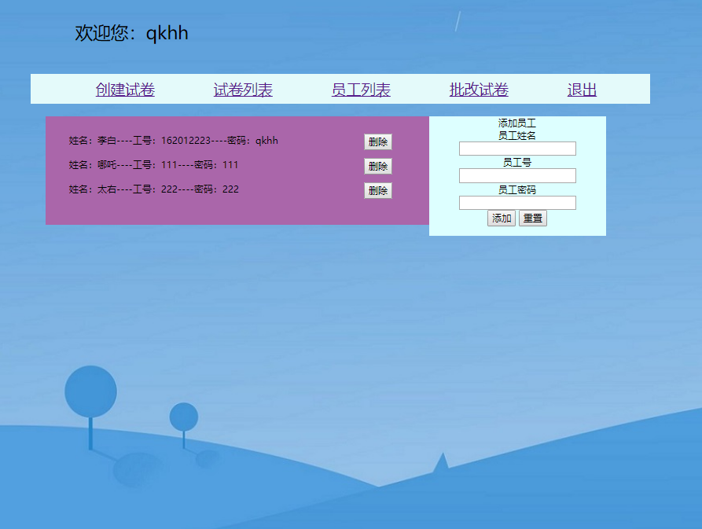
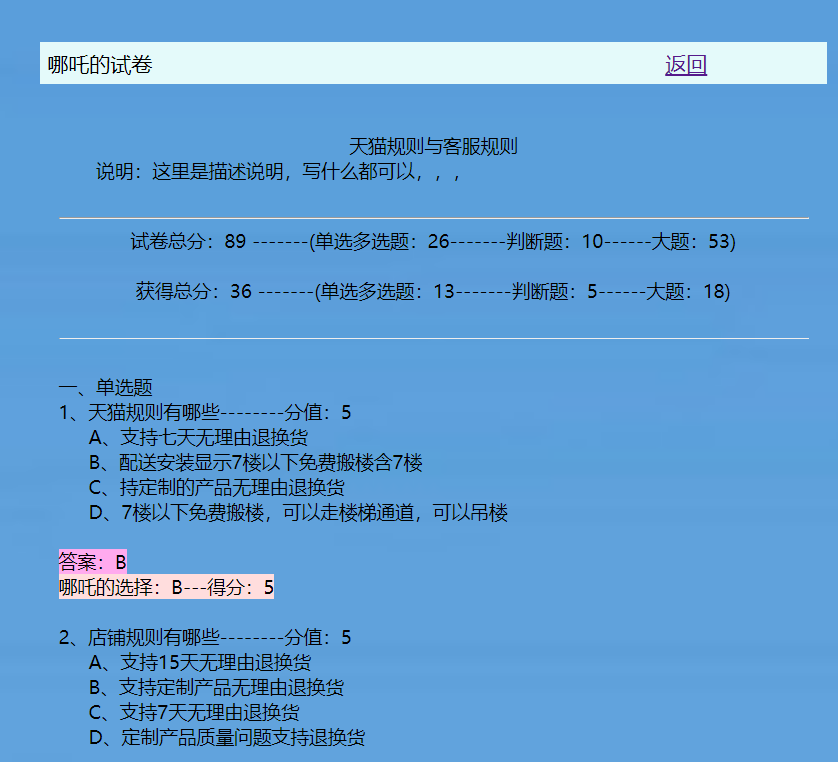
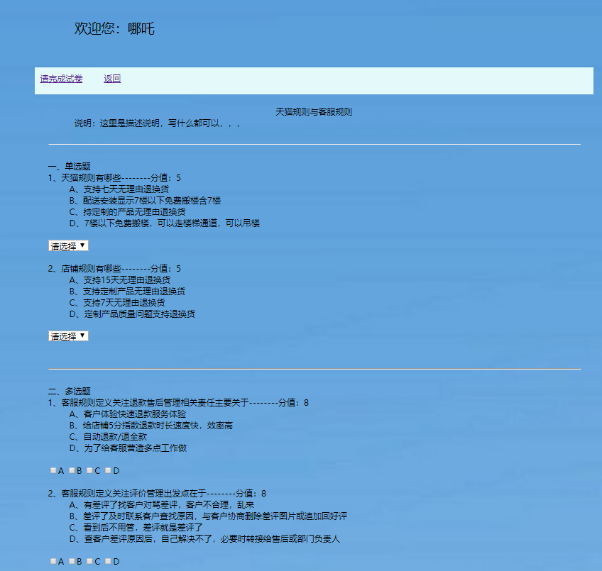

# AnswerSystem
##基于java web的在线创建试题答题管理系统Online creation test answer management system based on java web

##AnswerSystem答题系统，分管理员和用户 登录。
  ###管理员 ：\ 
     可以添加删除用户\ 
     可以创建一张空白试卷\ 
     可以设置某一张试卷的状态。on/no.（用户可以看见/不可以看见）\ 
     可以对一张试卷进行设置题型(单选题、多选题、判断题、问答题等)，并设置分值答案。\ 
     对已经创建的试卷删除，单个题目删除。\ 
     预览试卷\ 
     查看用户已经作答的试卷，并可以对问答题等大题评分。\ \ 
  ###用户 ：\ 
     能查看到所有状态为on的试卷\ 
     进行试卷并进行考试，试卷只能提交一次。\ 
     完成试卷后，可以实时查看单选、多选、判断题的成绩。
     
  

##环境:
  jdk1.7
  myeclipse10
  tomcat7
  mysql

##部署：
   ###1、导入项目到myeclipse中，添加本地的tomcat服务器。
   
   ###2、在mysql中 创建数据库，名称为answersystem.如下 
          create database answersystem;
      使用数据库 如下
          use answersystem;
      最后，把数据库文件answersystem.sql 复制、粘贴---完成。
     
   ###3、 在tomcat7本地的server.xml文件中，在</Host>标签之前添加如下信息：
   
    <Context path="/AnswerSystem" docBase="AnswerSystem"
	         debug="5" reloadable="true" crossContext="true"   workDir="">
	   <Resource   name="jdbc/AnswerSource"
	              auth="Container"
	     type="javax.sql.DataSource"
	              maxActive="100" maxIdle="30" maxWait="10000"
	              username="root" password="123"
	     driverClassName="com.mysql.jdbc.Driver"
	     url="jdbc:mysql://localhost/answersystem"/>
	  </Context>
 
     其中path处为项目名称（AnswerSystem），
     Resource标签下的name="jdbc/AnswerSource"为连接的数据源名称，需要与项目的web.xml处的名称相同
     password需要改成你自己的密码。
     url中的answersystem为数据库名称。
    
    ###4、myeclipse中选择tomcat7 启动项目
       在浏览器中访问：http://localhost:8080/AnswerSystem/
       登录的密码请查看数据库文件。
       
       
       
       
       
       
       
